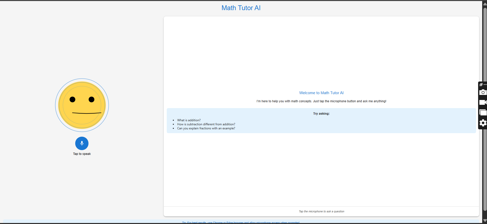

# Math Tutor AI - Conversational Learning Assistant



## Overview

Math Tutor AI is a conversational educational assistant that helps students learn fundamental math concepts through natural language interactions. This project was developed as part of the technical assessment for Revin Techno Solutions Private Limited. It combines Retrieval-Augmented Generation (RAG) with an expressive animated mascot to create an engaging learning experience for children.

The system listens to user questions via speech recognition, processes them through a RAG-powered backend, and responds with spoken explanations while showing appropriate emotions through the animated mascot.

## Key Features

- 🗣️ **Speech-to-Text (STT)**: Listen to user questions via microphone
- 🔊 **Text-to-Speech (TTS)**: AI responds with spoken answers
- 🎭 **Animated Mascot**: Shows emotions based on context (happy, thinking, explaining, etc.)
- 💬 **Conversational Interface**: Multi-turn dialogue capabilities
- 📚 **RAG-Powered Knowledge**: Accurate math concept explanations
- 👶 **Child-Friendly Design**: Simple, engaging interface suitable for young learners

## Architecture

This project follows a clean, modular architecture that separates concerns while maintaining cohesive functionality:

```
User Interaction → Speech Recognition → API Request → RAG Backend → API Response → Text-to-Speech + Mascot Animation
```

### Detailed Flow

1. **User Speaks Question**
   - User clicks microphone button and asks a math question
   - Web Speech API captures audio and converts to text

2. **API Request to Backend**
   - Frontend sends text query to backend API
   - Includes conversation history for context

3. **RAG Backend Processing**
   - LangChain processes the query
   - Vector database retrieves relevant math concepts
   - Gemini API generates a natural language response
   - Emotion detection determines appropriate emotional state

4. **Response Handling**
   - Backend returns response text and emotion state
   - Frontend triggers TTS to speak the response
   - Mascot animation updates to match the emotion
   - Conversation history is updated in UI

## Getting Started

### Prerequisites

- Python 3.9+
- Node.js 16+
- Google Cloud account with Gemini API enabled
- API key for Gemini API

### Backend Setup

1. Clone the repository:
```bash
git clone https://github.com/yourusername/math-tutor-ai.git
cd math-tutor-ai/backend
```

2. Create a virtual environment and install dependencies:
```bash
python -m venv venv
source venv/bin/activate  # Linux/MacOS
venv\Scripts\activate    # Windows
pip install -r requirements.txt
```

3. Set up environment variables:
```bash
echo "GOOGLE_API_KEY=your_api_key_here" > .env
```

4. Run the backend server:
```bash
python main.py
```

### Frontend Setup

1. Navigate to the frontend directory:
```bash
cd ../frontend
```

2. Install dependencies:
```bash
npm install
```

3. Start the development server:
```bash
npm start
```

4. Open `http://localhost:3000` in your browser

## Project Structure

### Backend

- `main.py`: FastAPI application with endpoints
- `rag.py`: RAG implementation with LangChain and emotion detection
- `config.py`: Configuration settings and paths
- `requirements.txt`: Python dependencies
- `data/math_concepts.txt`: Training data for the RAG system

### Frontend

- `public/index.html`: HTML entry point
- `src/components/Mascot.js`: Animated mascot implementation using SVG and GSAP
- `src/components/Mascot.css`: Styles for the mascot component
- `src/services/apiService.js`: API communication layer with rate limit handling
- `src/App.js`: Main application component with speech recognition and synthesis
- `src/index.js`: JavaScript entry point
- `src/index.css`: Global CSS styles
- `package.json`: Frontend dependencies and scripts

## Technology Stack

### Backend
- **Framework**: FastAPI
- **RAG**: LangChain, ChromaDB
- **LLM**: Google Gemini API
- **Vector DB**: ChromaDB
- **Embeddings**: HuggingFace all-MiniLM-L6-v2

### Frontend
- **Framework**: React
- **UI Library**: Material UI
- **Animations**: GSAP (GreenSock Animation Platform)
- **Speech**: Web Speech API
- **State Management**: React hooks

## Usage

1. Launch the backend server (`python main.py`)
2. Launch the frontend (`npm start`)
3. Open the application in your browser
4. Click the microphone button and ask a math question
5. The mascot will listen, process your question, and respond with an explanation

The mascot will show different emotions based on the context:
- **Happy**: When providing positive feedback or correct answers
- **Thinking**: When processing questions or showing uncertainty
- **Explaining**: When providing detailed mathematical explanations
- **Listening**: When actively listening to user input
- **Neutral**: Default state when waiting for input
- **Error**: When encountering API limitations or errors

## Troubleshooting

### Common Issues

**1. "Cannot read properties of undefined" errors**
- This typically occurs when the mascot animations aren't properly initialized
- Solution: Ensure GSAP is properly imported in Mascot.js:
  ```javascript
  import { gsap, Power2 } from 'gsap';
  ```

**2. Rate Limit Errors (429)**
- Gemini API has strict rate limits (5 RPM for Free Tier)
- Solutions:
  - Wait 1-2 minutes between requests
  - Ensure billing is enabled for your Google Cloud project
  - The application includes client-side rate limiting to prevent rapid requests

**3. No Response from Backend**
- Check if the backend server is running (`python main.py`)
- Verify the port is correct (default: 8000)
- Check browser console for CORS errors

**4. Speech Recognition Not Working**
- Ensure you're using Chrome, Edge, or Safari (Web Speech API is not supported in all browsers)
- Check browser permissions for microphone access
- Look for browser-specific error messages in the console

## Development Journey

### Planning Phase
- Analyzed the assessment requirements thoroughly
- Designed architecture focusing on modularity and maintainability
- Selected appropriate technologies for each component

### Backend Development
1. Set up RAG pipeline with LangChain
   - Created document loaders for math content
   - Implemented text splitters and embeddings
   - Configured ChromaDB vector store

2. Integrated Gemini API as LLM
   - Handled API authentication securely
   - Implemented prompt engineering for educational context
   - Added emotion detection logic based on response content

3. Built REST API endpoints
   - Created `/query` and `/chat` endpoints
   - Implemented rate limiting handling
   - Added proper error handling

### Frontend Development
1. Designed the mascot using SVG and GSAP
   - Created multiple emotional states (happy, thinking, explaining, etc.)
   - Implemented smooth transitions between states
   - Added mouth movement during speech

2. Integrated speech recognition and synthesis
   - Implemented Web Speech API for STT
   - Created TTS service with emotion-based voice modulation
   - Handled browser compatibility issues

3. Built the conversation interface
   - Designed clean, child-friendly UI
   - Implemented conversation history
   - Added visual feedback for loading states

### Testing and Refinement
- Conducted extensive testing with various math questions
- Refined mascot animations to be more expressive and child-friendly
- Optimized backend for faster response times
- Added error handling for rate limits and API failures
- Performed user testing to ensure the interface is intuitive for children

## Challenges Overcome

### 1. Mascot Animation Complexity
- Initially tried using Lottie but encountered "Cannot read properties of undefined" errors
- Switched to SVG + GSAP for better control and reliability
- Implemented smooth transitions between emotional states
- Created realistic mouth movement during speech

### 2. Rate Limit Handling
- Gemini API has strict rate limits (5 RPM for Free Tier)
- Implemented client-side rate limiting with request queuing
- Added user-friendly feedback when limits are reached
- Created fallback responses to maintain conversation flow

### 3. Child-Friendly Design
- Simplified UI with large, clear buttons
- Made mascot more expressive with subtle animations
- Ensured color scheme is appealing to children
- Added speech wave indicators for visual feedback

## Lessons Learned

1. **Animation Matters**: Well-designed animations significantly improve user engagement, especially for educational tools targeting children.

2. **Rate Limits are Real**: Planning for API limitations from the start prevents major issues later in development.

3. **Simplicity Wins**: For educational tools, a clean, uncluttered interface helps maintain focus on learning.

4. **Testing with Target Users**: Early feedback from actual students helped refine the mascot's expressions and the overall UX.

## Future Improvements

- Add personalized learning paths based on user interactions
- Implement progress tracking for students
- Expand math content coverage
- Add multi-language support
- Create teacher dashboard for monitoring student progress

## Demo Video

[Watch the demo video](docs/demo_video/demo.mp4) to see the application in action:
- User speaking a question about addition
- Mascot listening and processing
- Mascot responding with explanation and appropriate emotions
- Conversation history display

## Architecture Slides

The architecture slides are available in the [docs/](docs/) directory, showing:
1. System architecture diagram
2. Data flow from STT to RAG to TTS
3. Mascot animation states and transitions
4. Error handling workflow

## Contributing

Contributions are welcome! Please follow these steps:
1. Fork the repository
2. Create your feature branch (`git checkout -b feature/AmazingFeature`)
3. Commit your changes (`git commit -m 'Add some AmazingFeature'`)
4. Push to the branch (`git push origin feature/AmazingFeature`)
5. Open a Pull Request

## License

This project is licensed under the MIT License - see the [LICENSE](LICENSE) file for details.

## Credits

- Developed by: Srinath Selvakumar
